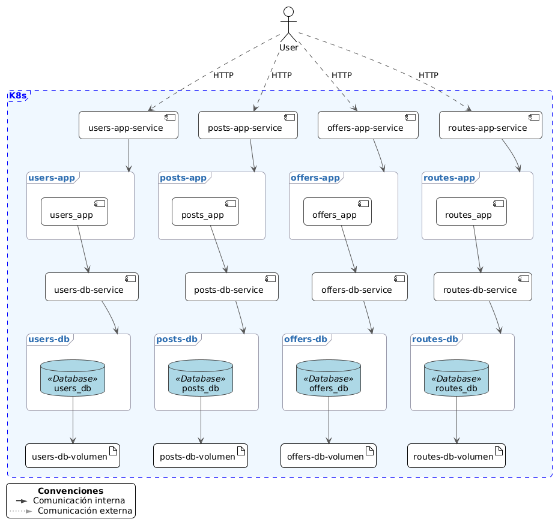
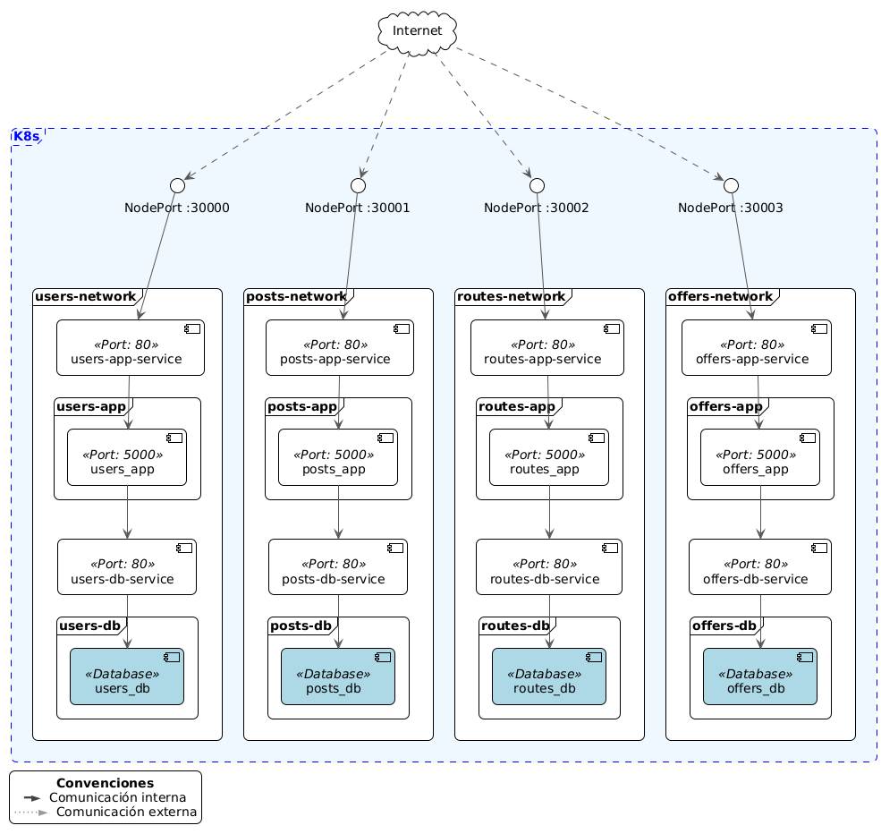

# Vista de Despliegue

## Descripción General

La vista de despliegue describe cómo los componentes de la vista funcional están siendo desplegados en el entorno de producción. El sistema utiliza Kubernetes como plataforma de orquestación de contenedores, con Minikube para el entorno de desarrollo local.

## Arquitectura de Despliegue

### Plataforma de Orquestación

- **Kubernetes**: Plataforma principal de orquestación de contenedores
- **Minikube**: Clúster local de Kubernetes para desarrollo y testing
- **Namespace**: Todas las aplicaciones se despliegan en el namespace `default`

### Estrategia de Contenedores

Cada microservicio se despliega como un conjunto de contenedores independientes:

- **Contenedor de Aplicación**: Flask application con la lógica de negocio
- **Contenedor de Base de Datos**: PostgreSQL para persistencia de datos

### Servicios de Red

- **NodePort Services**: Para aplicaciones, permiten acceso externo
- **ClusterIP Services**: Para bases de datos, acceso interno únicamente
- **Network Policies**: Aislamiento de red entre microservicios

## Modelo de Despliegue

### Estructura de Pods

Cada microservicio se despliega en pods separados:

1. **Users Pod**

   - Contenedor: Users App (Flask + SQLAlchemy)
   - Contenedor: Users DB (PostgreSQL 13)
   - Puerto: 5000 (app), 5432 (db)

2. **Posts Pod**

   - Contenedor: Posts App (Flask + SQLAlchemy)
   - Contenedor: Posts DB (PostgreSQL 13)
   - Puerto: 5000 (app), 5432 (db)

3. **Offers Pod**

   - Contenedor: Offers App (Flask + SQLAlchemy)
   - Contenedor: Offers DB (PostgreSQL 13)
   - Puerto: 5000 (app), 5432 (db)

4. **Routes Pod**
   - Contenedor: Routes App (Flask + SQLAlchemy)
   - Contenedor: Routes DB (PostgreSQL 13)
   - Puerto: 5000 (app), 5432 (db)

### Configuración de Servicios

- **Users Service**: NodePort 30001
- **Posts Service**: NodePort 30001
- **Routes Service**: NodePort 30002
- **Offers Service**: NodePort 30003

## Diagrama de Despliegue

## Modelo de Red

### Aislamiento de Red

El sistema implementa aislamiento de red mediante Network Policies de Kubernetes:

- **Users Network**: Aislamiento completo, solo permite conexiones a su propia base de datos
- **Posts Network**: Aislamiento completo, solo permite conexiones a su propia base de datos
- **Offers Network**: Aislamiento completo, solo permite conexiones a su propia base de datos
- **Routes Network**: Aislamiento completo, solo permite conexiones a su propia base de datos

### Políticas de Red

- **Ingress**: Permite tráfico entrante a los puertos de aplicación (5000)
- **Egress**: Restringe el tráfico saliente solo a las bases de datos correspondientes (5432)
- **Namespace Isolation**: Todas las aplicaciones están en el namespace `default`

## Diagrama de Red

## Configuración de Recursos

### Volúmenes

- **emptyDir**: Volúmenes efímeros para bases de datos
- **Persistencia**: Los datos se pierden al reiniciar los pods
- **Desarrollo**: Configuración adecuada para desarrollo local

### Variables de Entorno

Cada aplicación requiere las siguientes variables:

- `DATABASE_URI`: Conexión a la base de datos PostgreSQL
- `FLASK_ENV`: Entorno de ejecución (development/production)
- `POSTGRES_DB`: Nombre de la base de datos
- `POSTGRES_USER`: Usuario de la base de datos
- `POSTGRES_PASSWORD`: Contraseña de la base de datos

### Puertos y Conectores

- **Aplicaciones**: Puerto 5000 (HTTP)
- **Bases de Datos**: Puerto 5432 (PostgreSQL)
- **Servicios NodePort**: 30001, 30003, 30004
- **Protocolos**: HTTP/REST, PostgreSQL

## Estrategias de Despliegue

### Despliegue Local

1. **Minikube**: Inicialización del clúster local
2. **Docker Images**: Construcción de imágenes locales
3. **Kubernetes Manifests**: Aplicación de configuraciones YAML
4. **Port Forwarding**: Acceso a servicios para testing

### Escalabilidad

- **Replicas**: Configuración de múltiples réplicas por aplicación
- **Auto-scaling**: Configuración de HPA (Horizontal Pod Autoscaler)
- **Load Balancing**: Distribución de carga mediante servicios Kubernetes

### Monitoreo y Logging

- **Health Checks**: Endpoints `/ping` para verificación de estado
- **Logs**: Logs centralizados de aplicaciones y bases de datos
- **Metrics**: Métricas de rendimiento y recursos

## Seguridad

### Network Policies

- Aislamiento completo entre microservicios
- Restricción de acceso a bases de datos
- Control de tráfico entrante y saliente

### Autenticación

- Tokens UUID para autenticación
- No uso de JWT (según especificación)
- Gestión de sesiones temporales

### Base de Datos

- Conexiones aisladas por microservicio
- Credenciales específicas por aplicación
- No acceso cruzado entre bases de datos
