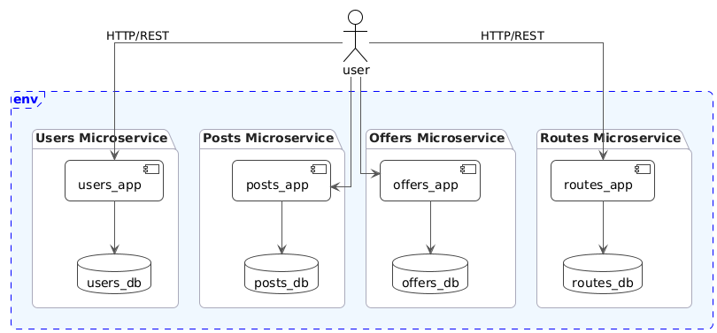

# Vista Funcional

## Descripción General

La vista funcional describe los componentes desarrollados en el sistema de microservicios. El sistema está compuesto por cuatro microservicios independientes, cada uno responsable de un dominio específico del negocio: gestión de usuarios, gestión de publicaciones, gestión de ofertas y gestión de rutas.

## Componentes del Sistema

### Users Microservice

Responsable de la gestión de usuarios del sistema, incluyendo registro, autenticación y gestión de perfiles.

**Componentes principales:**

- **Users API**: Endpoints REST para operaciones CRUD de usuarios
- **User Management**: Lógica de negocio para gestión de usuarios
- **Authentication**: Sistema de autenticación basado en tokens UUID
- **Users DB**: Base de datos PostgreSQL para almacenamiento de usuarios

**Funcionalidades:**

- Registro de usuarios
- Autenticación y generación de tokens
- Consulta y actualización de perfiles
- Gestión de sesiones

### Posts Microservice

Responsable de la gestión de publicaciones que los usuarios crean para anunciar necesidades de transporte.

**Componentes principales:**

- **Posts API**: Endpoints REST para operaciones CRUD de publicaciones
- **Post Management**: Lógica de negocio para gestión de publicaciones
- **Posts DB**: Base de datos PostgreSQL para almacenamiento de publicaciones

**Funcionalidades:**

- Creación de publicaciones
- Consulta y filtrado de publicaciones
- Eliminación de publicaciones
- Gestión de fechas de expiración

### Offers Microservice

Responsable de la gestión de ofertas que los usuarios hacen para transportar objetos.

**Componentes principales:**

- **Offers API**: Endpoints REST para operaciones CRUD de ofertas
- **Offer Management**: Lógica de negocio para gestión de ofertas
- **Offers DB**: Base de datos PostgreSQL para almacenamiento de ofertas

**Funcionalidades:**

- Creación de ofertas
- Consulta y filtrado de ofertas
- Eliminación de ofertas
- Gestión de precios y características de objetos

### Routes Microservice

Responsable de la gestión de rutas de viaje que conectan diferentes ciudades.

**Componentes principales:**

- **Routes API**: Endpoints REST para operaciones CRUD de rutas
- **Route Management**: Lógica de negocio para gestión de rutas
- **Routes DB**: Base de datos PostgreSQL para almacenamiento de rutas

**Funcionalidades:**

- Creación de rutas
- Consulta y filtrado de rutas
- Eliminación de rutas
- Gestión de costos y fechas de viaje

## Comunicación entre Componentes

### APIs REST

Todos los microservicios exponen APIs REST para comunicación externa:

- **Users API**: `http://users-service:30000`
- **Posts API**: `http://posts-service:30001`
- **Routes API**: `http://routes-service:30002`
- **Offers API**: `http://offers-service:30003`

### Endpoints Comunes

Cada microservicio implementa endpoints estándar:

- `GET /ping`: Verificación de estado del servicio
- `POST /reset`: Limpieza de la base de datos
- Endpoints específicos del dominio

### Aislamiento

- Los microservicios no se comunican directamente entre sí
- Cada microservicio maneja únicamente su propio dominio
- La comunicación se realiza a través de APIs REST desde aplicaciones cliente

## Diagrama de Componentes

## Tecnologías por Componente

### Framework Web

- **Flask**: Framework web para todos los microservicios
- **Flask-Smorest**: Extensión para APIs REST con documentación automática

### Base de Datos

- **SQLAlchemy**: ORM para acceso a bases de datos
- **PostgreSQL**: Base de datos principal para todos los microservicios
- **psycopg2**: Driver PostgreSQL para Python

### Validación y Serialización

- **Marshmallow**: Serialización y validación de datos JSON
- **UUID**: Generación y validación de identificadores únicos

### Testing

- **pytest**: Framework de testing para todos los microservicios
- **pytest-cov**: Cobertura de código
- **SQLite**: Base de datos para testing

## Patrones de Diseño

### Arquitectura de Capas

Cada microservicio sigue una arquitectura de capas:

1. **Capa de Presentación**: APIs REST
2. **Capa de Lógica de Negocio**: Gestión de entidades
3. **Capa de Datos**: Acceso a base de datos

### Factory Pattern

- Patrón de fábrica para creación de aplicaciones Flask
- Configuración centralizada de bases de datos
- Inyección de dependencias

### Repository Pattern

- Abstracción del acceso a datos
- Separación entre lógica de negocio y persistencia
- Facilita testing y mantenimiento

## Escalabilidad y Mantenibilidad

### Independencia

- Cada microservicio puede ser desarrollado, desplegado y escalado independientemente
- Cambios en un microservicio no afectan a otros
- Tecnologías y versiones pueden evolucionar independientemente

### Testing

- Tests unitarios para cada componente
- Tests de integración para APIs
- Cobertura mínima del 70% por microservicio

### Documentación

- Documentación automática de APIs con Swagger/OpenAPI
- README específico para cada microservicio
- Documentación técnica centralizada
