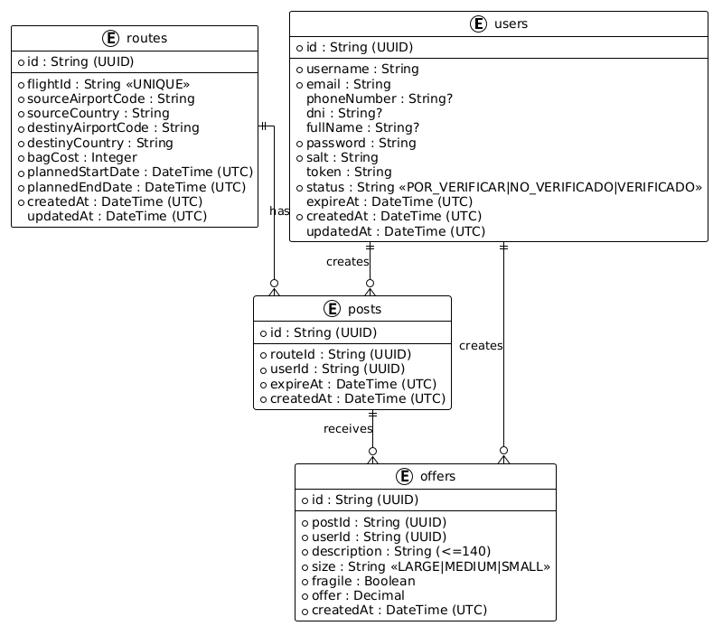

# Vista de Información

## Descripción General

La vista de información describe los datos que maneja el sistema de microservicios. El sistema está compuesto por cuatro entidades principales que representan los diferentes aspectos del dominio de negocio: usuarios, publicaciones, ofertas y rutas.

## Modelo de Entidades

El sistema maneja las siguientes entidades principales:

### User (Usuario)

Representa a los usuarios del sistema que pueden crear publicaciones y ofertas.

**Atributos:**

- `id` (String, UUID): Identificador único del usuario
- `username` (String): Nombre de usuario único
- `email` (String): Correo electrónico del usuario
- `phoneNumber` (String, opcional): Número de teléfono para contacto
- `dni` (String, opcional): Documento de identidad del usuario
- `fullName` (String, opcional): Nombre completo del usuario
- `password` (String): Contraseña cifrada del usuario
- `salt` (String): Sal utilizada para el cifrado de la contraseña
- `token` (String, UUID): Token de autenticación temporal
- `status` (String): Estado del usuario (`POR_VERIFICAR`, `NO_VERIFICADO`, `VERIFICADO`)
- `expireAt` (DateTime, UTC): Fecha de expiración de la última sesión
- `createdAt` (DateTime, UTC): Fecha de creación del usuario
- `updatedAt` (DateTime, UTC): Fecha de actualización del usuario

### Post (Publicación)

Representa las publicaciones que los usuarios crean para anunciar que necesitan transportar algo en una ruta específica.

**Atributos:**

- `id` (String, UUID): Identificador único de la publicación
- `routeId` (String, UUID): Identificador del trayecto asociado
- `userId` (String, UUID): Referencia al usuario que creó la publicación
- `expireAt` (DateTime, UTC): Fecha de expiración de la publicación
- `createdAt` (DateTime, UTC): Fecha de creación de la publicación

### Offer (Oferta)

Representa las ofertas que los usuarios hacen para transportar objetos en rutas específicas.

**Atributos:**

- `id` (String, UUID): Identificador único de la oferta
- `postId` (String, UUID): Identificador de la publicación asociada
- `userId` (String, UUID): Referencia al usuario que creó la oferta
- `description` (String): Descripción (máx. 140 caracteres) del objeto a transportar
- `size` (String): Tamaño del objeto (`SMALL`, `MEDIUM`, `LARGE`)
- `fragile` (Boolean): Indica si el objeto es frágil
- `offer` (Float): Precio ofrecido por el transporte
- `createdAt` (DateTime, UTC): Fecha de creación de la oferta

### Route (Trayecto)

Representa los trayectos de viaje que conectan un origen con un destino.

**Atributos:**

- `id` (String, UUID): Identificador único del trayecto
- `flightId` (String): Identificador del vuelo (ejemplo: `AA001`) — único
- `sourceAirportCode` (String): Código del aeropuerto de origen
- `sourceCountry` (String): País de origen
- `destinyAirportCode` (String): Código del aeropuerto de destino
- `destinyCountry` (String): País de destino
- `bagCost` (Integer): Costo del envío de una maleta en el trayecto
- `plannedStartDate` (DateTime, UTC): Fecha planificada de inicio
- `plannedEndDate` (DateTime, UTC): Fecha planificada de finalización
- `createdAt` (DateTime, UTC): Fecha de creación del trayecto
- `updatedAt` (DateTime, UTC): Fecha de actualización del trayecto

## Relaciones entre Entidades

- **User → Post**: Un usuario puede crear múltiples publicaciones
- **User → Offer**: Un usuario puede crear múltiples ofertas
- **Route → Post**: Una ruta puede tener múltiples publicaciones
- **Route → Offer**: Una ruta puede tener múltiples ofertas

## Diagrama de Entidades

## Reglas de Negocio

### Validaciones de Datos

1. **UUIDs**: Todos los identificadores deben ser UUIDs válidos
2. **Fechas**: Todas las fechas se manejan en formato ISO 8601 con zona horaria UTC
3. **Tokens**: Los tokens de autenticación son UUIDs generados aleatoriamente
4. **Expiración**: Las publicaciones tienen fechas de expiración que deben ser futuras
5. **Tamaños**: Los tamaños de objetos en ofertas deben ser S, M, L o XL
6. **Precios**: Los valores monetarios deben ser números positivos

### Aislamiento de Datos

- Cada microservicio maneja únicamente sus propias entidades
- No hay referencias directas entre bases de datos de diferentes microservicios
- La comunicación entre microservicios se realiza mediante APIs REST

### Persistencia

- Todas las entidades se almacenan en bases de datos PostgreSQL
- Cada microservicio tiene su propia base de datos aislada
- Los datos se pueden limpiar mediante endpoints `/reset`
- Se mantiene auditoría de fechas de creación para todas las entidades
