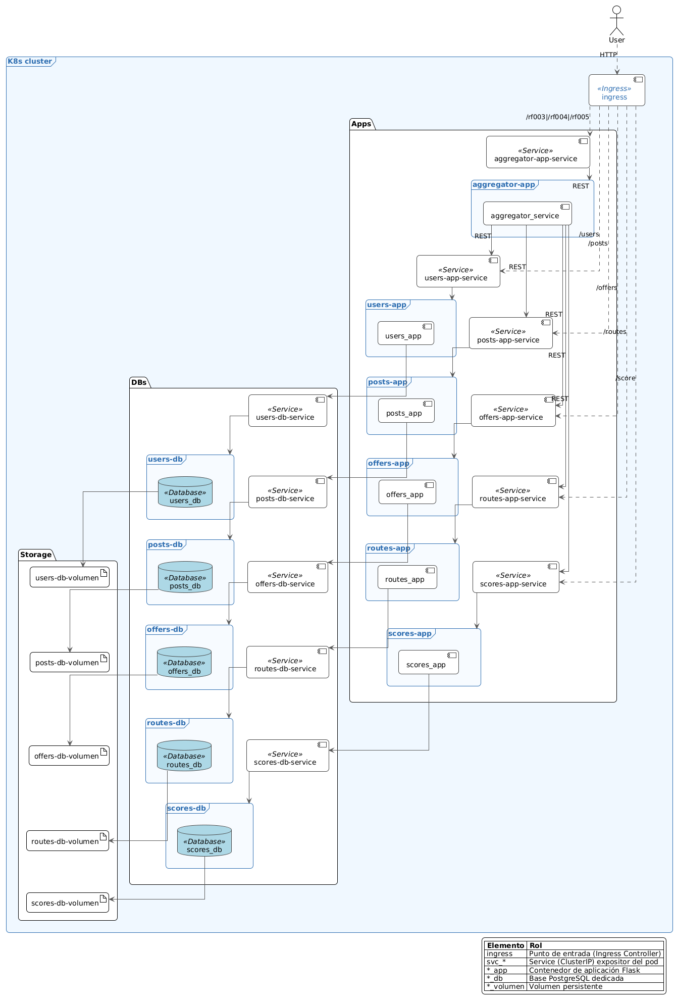
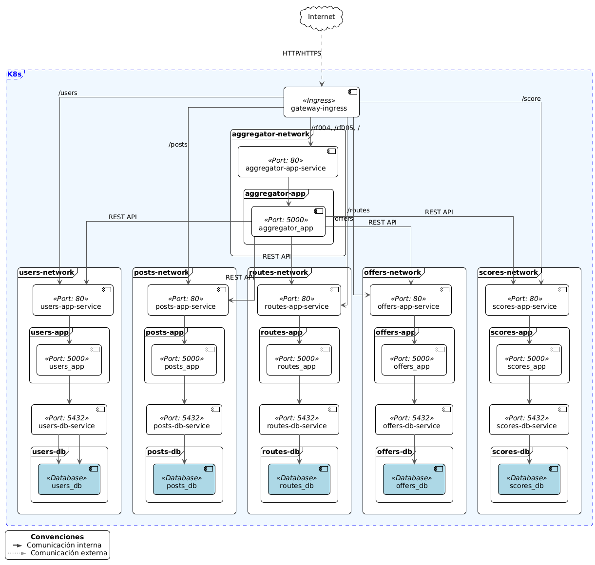

# Vista de Despliegue

## Descripción General

La solución se despliega sobre Kubernetes (EKS en producción / Minikube en desarrollo). A los cuatro microservicios iniciales se suman Aggregator (orquestación) y Scores (utilidad). Un único Ingress concentra el acceso externo y distribuye tráfico por prefijo.

## Arquitectura de Despliegue

### Plataforma de Orquestación

- **Kubernetes**: Plataforma principal de orquestación de contenedores
- **Minikube**: Clúster local de Kubernetes para desarrollo y testing
- **Namespace**: Todas las aplicaciones se despliegan en el namespace `default`

### Estrategia de Contenedores

Cada servicio de aplicación se ejecuta como contenedor stateless; cada dominio mantiene su propia instancia de base de datos PostgreSQL (aislamiento por servicio). Para desarrollo se permiten despliegues efímeros.

### Servicios de Red

- **ClusterIP**: Exposición interna de cada servicio.
- **Ingress**: Distribuye solicitudes externas a Aggregator y a servicios base (`/users`, `/posts`, `/offers`, `/routes`, `/score`, `/rf004`, `/rf005`).
- **Aislamiento lógico**: Basado en separación de responsabilidades; NetworkPolicies futuras podrían restringir acceso directo cliente → dominios.

## Modelo de Despliegue

### Estructura de Pods (Resumen)

| Pod        | Rol                      | Persistencia        |
| ---------- | ------------------------ | ------------------- |
| Users      | Autenticación y usuarios | PostgreSQL dedicada |
| Posts      | Publicaciones            | PostgreSQL dedicada |
| Offers     | Ofertas                  | PostgreSQL dedicada |
| Routes     | Trayectos y costos       | PostgreSQL dedicada |
| Scores     | Utilidad de ofertas      | PostgreSQL dedicada |
| Aggregator | Orquestación RF003–RF005 | Sin BD propia       |

### Configuración de Servicios

El Ingress enruta prefijos a servicios lógicos; sólo se exponen servicios como `ClusterIP`. NodePorts previos no son necesarios en el modelo consolidado.

## Diagrama de Despliegue

El diagrama actualizado incluye Aggregator (frontal lógico) y Scores.

## Modelo de Red

### Aislamiento de Red

El aislamiento se soporta por separación de bases de datos y uso de Aggregator para flujos compuestos. NetworkPolicies adicionales pueden restringir comunicaciones en evoluciones futuras.

### Políticas de Red

- **Ingress**: Redirige prefijos a servicios lógicos.
- **Egress**: Servicios de aplicación sólo requieren salida hacia sus propias bases de datos.
- **Namespace**: Todo reside en `default` según restricción del curso.

## Diagrama de Red

## Configuración de Recursos

### Volúmenes

- Desarrollo: volúmenes efímeros (emptyDir).
- Producción: servicios gestionados (RDS) sin alterar el contrato de aplicación.

### Variables de Entorno

Cada aplicación requiere las siguientes variables:

- `DATABASE_URI`: Conexión a la base de datos PostgreSQL
- `FLASK_ENV`: Entorno de ejecución (development/production)
- `POSTGRES_DB`: Nombre de la base de datos
- `POSTGRES_USER`: Usuario de la base de datos
- `POSTGRES_PASSWORD`: Contraseña de la base de datos

### Puertos y Conectores

- Aplicaciones: 5000 interno
- Bases de datos: 5432 interno
- Acceso externo: Ingress → Aggregator / dominios
- Protocolos: HTTP/REST, PostgreSQL

## Estrategias de Despliegue

### Despliegue Local

1. **Minikube**: Inicialización del clúster local
2. **Docker Images**: Construcción de imágenes locales
3. **Kubernetes Manifests**: Aplicación de configuraciones YAML
4. **Port Forwarding**: Acceso a servicios para testing

### Escalabilidad

- Aggregator: Escalado horizontal según demanda (lecturas compuestas RF005).
- Scores: Escala por volumen de escritura (RF004) y lectura (RF005).
- Dominios: Escalan autónomamente.
- Balanceo: Service + Ingress.

### Monitoreo y Logging

- Health Checks: `/rf005/ping` (Aggregator), `/ping` (dominios).
- Logs: Orquestación y errores transversales.
- Métricas sugeridas: Latencia RF003/4/5, errores 5xx por servicio.

## Seguridad

### Network Policies

- Aislamiento completo entre microservicios
- Restricción de acceso a bases de datos
- Control de tráfico entrante y saliente

### Autenticación

- Tokens UUID (no JWT).
- Validación y propagación desde Aggregator.

### Base de Datos

- Conexiones aisladas y sin acceso cruzado.
- Scores mantiene independencia y sólo depende de IDs de ofertas.
