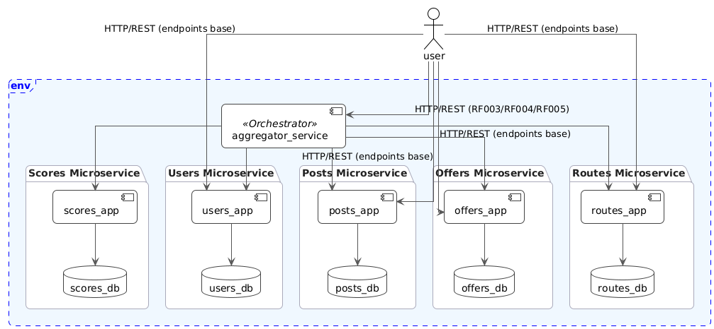
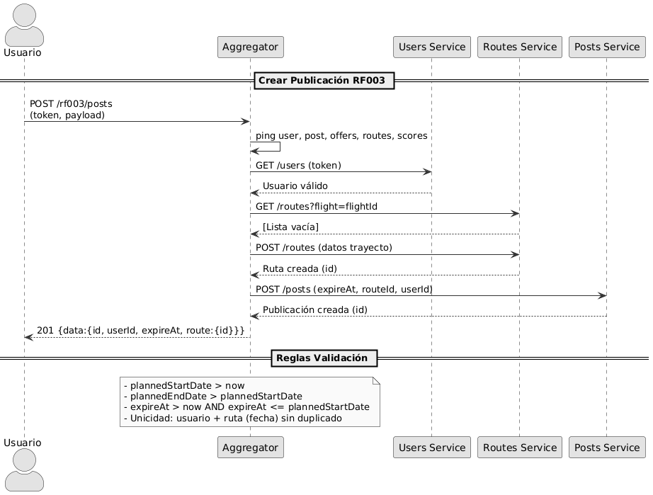
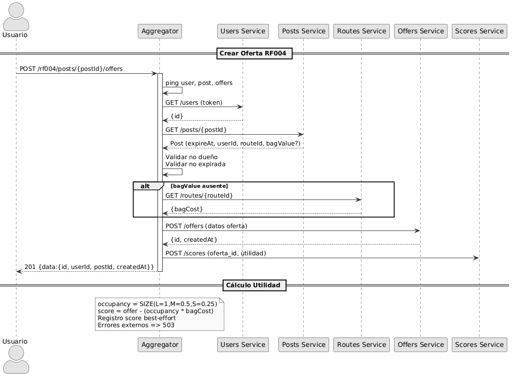
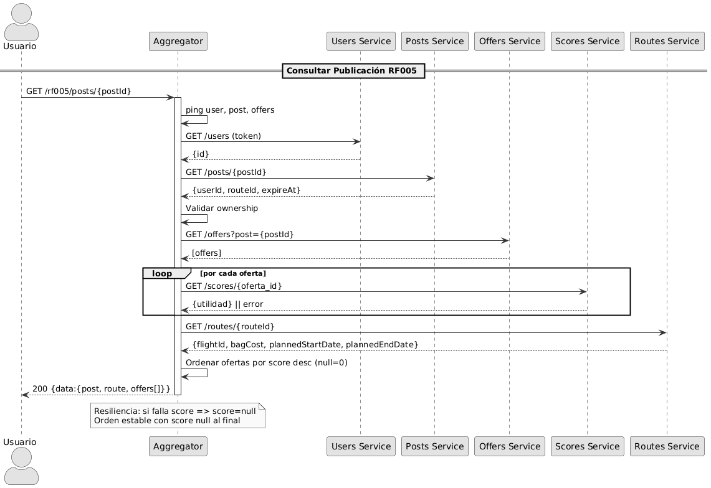

# Vista Funcional

## Descripción General

Esta vista presenta los componentes que conforman la solución. La primera iteración incluyó cuatro microservicios de dominio (Usuarios, Publicaciones, Ofertas y Rutas). En la evolución actual se incorporan:

- **Aggregator**: Orquestador que expone endpoints compuestos para RF-003, RF-004 y RF-005 reduciendo llamadas del cliente a una sola petición por requerimiento.
- **Scores**: Servicio de persistencia de la utilidad (score) asociada a cada oferta, integrado en modo best‑effort.

El objetivo principal de la ampliación es centralizar validaciones transversales, optimizar la experiencia de cliente y mejorar resiliencia ante fallos parciales.

## Componentes del Sistema

### Aggregator Service (Orquestador)

Expone endpoints compuestos y coordina servicios internos. Centraliza validaciones de autenticación, ownership, expiraciones y unicidad; ensambla respuestas coherentes y degradables.

**Componentes principales:**

- **Aggregator API**: Endpoints compuestos `/rf003/posts`, `/rf004/posts/{id}/offers`, `/rf005/posts/{id}`
- **Workflows RF003/RF005**: Orquestación síncrona de secuencias (creación de ruta condicional, verificación de publicación, ensamble de datos)
- **Workflow RF004**: Cálculo de utilidad y registro best-effort
- **Health & Resilience**: Pings previos a servicios críticos y manejo homogéneo de errores (degradación a 503)

**Funcionalidades Clave:**

- Punto único para RF-003, RF-004 y RF-005
- Validaciones transversales uniformes
- Cálculo determinista de utilidad (score)
- Orquestación síncrona tolerante a fallos parciales (best‑effort con Scores)
- Ordenamiento de ofertas por utilidad descendente

### Scores Microservice

Almacena la utilidad (score) de cada oferta. Su indisponibilidad no bloquea la creación ni la consulta; RF-005 retorna `score = null` cuando no hay dato.

**Componentes principales:**

- **Scores API**: Endpoints para registrar y consultar utilidad de ofertas
- **Score Management**: Lógica de persistencia y validaciones básicas
- **Scores DB**: Base de datos PostgreSQL para almacenamiento de utilidades

**Funcionalidades:** Registro y consulta puntual de score; operación idempotente esperada para evitar duplicidades.

### Users Microservice

Gestión de usuarios, autenticación y perfil.

**Componentes principales:**

- **Users API**: Endpoints REST para operaciones CRUD de usuarios
- **User Management**: Lógica de negocio para gestión de usuarios
- **Authentication**: Sistema de autenticación basado en tokens UUID
- **Users DB**: Base de datos PostgreSQL para almacenamiento de usuarios

**Funcionalidades:**

- Registro de usuarios
- Autenticación y generación de tokens
- Consulta y actualización de perfiles
- Gestión de sesiones

### Posts Microservice

Gestión del ciclo de vida de publicaciones.

**Componentes principales:**

- **Posts API**: Endpoints REST para operaciones CRUD de publicaciones
- **Post Management**: Lógica de negocio para gestión de publicaciones
- **Posts DB**: Base de datos PostgreSQL para almacenamiento de publicaciones

**Funcionalidades:**

- Creación de publicaciones
- Consulta y filtrado de publicaciones
- Eliminación de publicaciones
- Gestión de fechas de expiración

### Offers Microservice

Gestión de ofertas sobre publicaciones activas.

**Componentes principales:**

- **Offers API**: Endpoints REST para operaciones CRUD de ofertas
- **Offer Management**: Lógica de negocio para gestión de ofertas
- **Offers DB**: Base de datos PostgreSQL para almacenamiento de ofertas

**Funcionalidades:**

- Creación de ofertas
- Consulta y filtrado de ofertas
- Eliminación de ofertas
- Gestión de precios y características de objetos

### Routes Microservice

Gestión de trayectos y costos de maleta asociados.

**Componentes principales:**

- **Routes API**: Endpoints REST para operaciones CRUD de rutas
- **Route Management**: Lógica de negocio para gestión de rutas
- **Routes DB**: Base de datos PostgreSQL para almacenamiento de rutas

**Funcionalidades:**

- Creación de rutas
- Consulta y filtrado de rutas
- Eliminación de rutas
- Gestión de costos y fechas de viaje

## Comunicación entre Componentes

### APIs REST

Todos los microservicios internos exponen APIs REST. El cliente sólo interactúa con un host expuesto vía Ingress. El Aggregator enruta y orquesta internamente:

- **Aggregator API** (punto único): expone `/rf003`, `/rf004`, `/rf005`
- **Users API**: Gestión de usuarios y autenticación
- **Posts API**: Gestión de publicaciones base
- **Routes API**: Gestión de rutas y costos de maleta
- **Offers API**: Gestión de ofertas individuales
- **Scores API**: Persistencia y consulta de utilidad

### Endpoints Comunes

Todos los servicios de dominio exponen:

- `GET /ping`: Salud
- `POST /reset`: Limpieza controlada (entornos de prueba)
- Endpoints del dominio

### Aislamiento

- Cada microservicio mantiene su base de datos y no comparte tablas.
- La comunicación entre dominios para los flujos RF-003, RF-004 y RF-005 ocurre únicamente a través del Aggregator (patrón Orchestrator). No hay acoplamientos directos entre servicios de dominio.
- La ausencia temporal del servicio de Scores no interrumpe RF-005 (score opcional con valor null) ni RF-004 (registro best-effort).

## Diagrama de Componentes

El diagrama incorpora Aggregator y Scores sin introducir dependencias laterales entre servicios de dominio.

## Tecnologías por Componente

### Framework Web

- **Flask**: Framework web para todos los microservicios
- **Flask-Smorest**: Extensión para APIs REST con documentación automática

### Base de Datos

- **SQLAlchemy**: ORM para acceso a bases de datos
- **PostgreSQL**: Base de datos principal para todos los microservicios
- **psycopg2**: Driver PostgreSQL para Python

### Validación y Serialización

- **Marshmallow**: Validación y serialización
- **UUID**: Identificadores únicos

### Testing (Microservicios)

- **pytest**: Framework de testing para todos los microservicios
- **pytest-cov**: Cobertura de código
- **SQLite**: Base de datos para testing

## Patrones de Diseño

### Arquitectura de Capas

Cada microservicio sigue una arquitectura de capas:

1. **Capa de Presentación**: APIs REST
2. **Capa de Lógica de Negocio**: Gestión de entidades
3. **Capa de Datos**: Acceso a base de datos

### Factory Pattern

- Patrón de fábrica para creación de aplicaciones Flask
- Configuración centralizada de bases de datos
- Inyección de dependencias

### Repository Pattern

- Abstrae persistencia y facilita pruebas

### Orchestrator Pattern (Aggregator)

- **Rol**: Centralizar la coordinación de microservicios para flujos compuestos que requieren múltiples validaciones y agregación de datos.
- **Beneficio**: Simplifica el cliente (una sola llamada), evita lógica distribuida en cada microservicio, mantiene independencia de datos.
- **Trade-offs**: Punto adicional a escalar; mitigado con diseño stateless y posibilidad de replicas.

### Best-Effort Integration (Scores)

Evita fallos totales si la persistencia de score está indisponible (`score = null`).

### Validation Gateway

Centraliza validaciones transversales para reducir duplicación y divergencias.

## Escalabilidad y Mantenibilidad

### Independencia

- Servicios de dominio escalan independientemente.
- Aggregator escala horizontalmente según uso de endpoints compuestos.
- Scores escala según ratio lectura/escritura de utilidades.

### Flujos Clave

| Requerimiento | Endpoint                      | Flujo Resumido                                                                                                                                        |
| ------------- | ----------------------------- | ----------------------------------------------------------------------------------------------------------------------------------------------------- |
| RF-003        | POST /rf003/posts             | Token → Validar fechas → Buscar/crear ruta → Unicidad → Crear publicación → Respuesta                                                                 |
| RF-004        | POST /rf004/posts/{id}/offers | Token → Usuario → Publicación → Ownership/Expiración → Derivar bagCost → Crear oferta → Calcular utilidad → Registrar score (best‑effort) → Respuesta |
| RF-005        | GET /rf005/posts/{id}         | Token → Usuario → Publicación → Ownership → Ofertas → Scores (best‑effort) → Ruta → Ordenar por score desc → Respuesta                                |

### Reglas de Negocio Consolidada (Resumen)

- Fechas en ISO UTC.
- Una publicación activa por usuario y ruta.
- Prohibido ofertar la propia publicación.
- Sólo publicaciones vigentes aceptan ofertas.
- offer > 0 y size ∈ {LARGE, MEDIUM, SMALL}.
- score = offer − (occupancy × bagCost) (occupancy por size).

### Testing

- Tests unitarios y de integración
- Cobertura ≥ 70% por microservicio

### Documentación

- APIs documentadas (Swagger/OpenAPI)
- READMEs por microservicio
- Documentación centralizada

## Diagramas de Secuencia

### RF-003

### RF-004

### RF-005

Cada diagrama muestra validaciones, llamadas a servicios y degradación controlada (best‑effort para Score en RF004/RF005).
