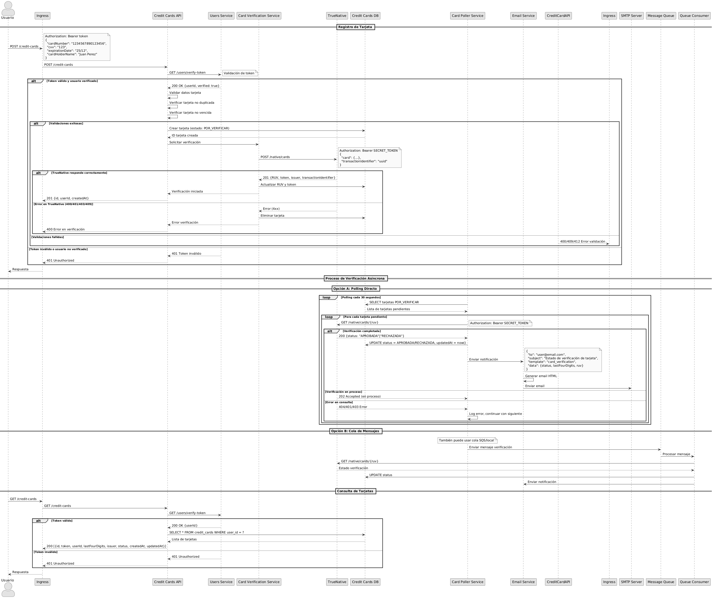
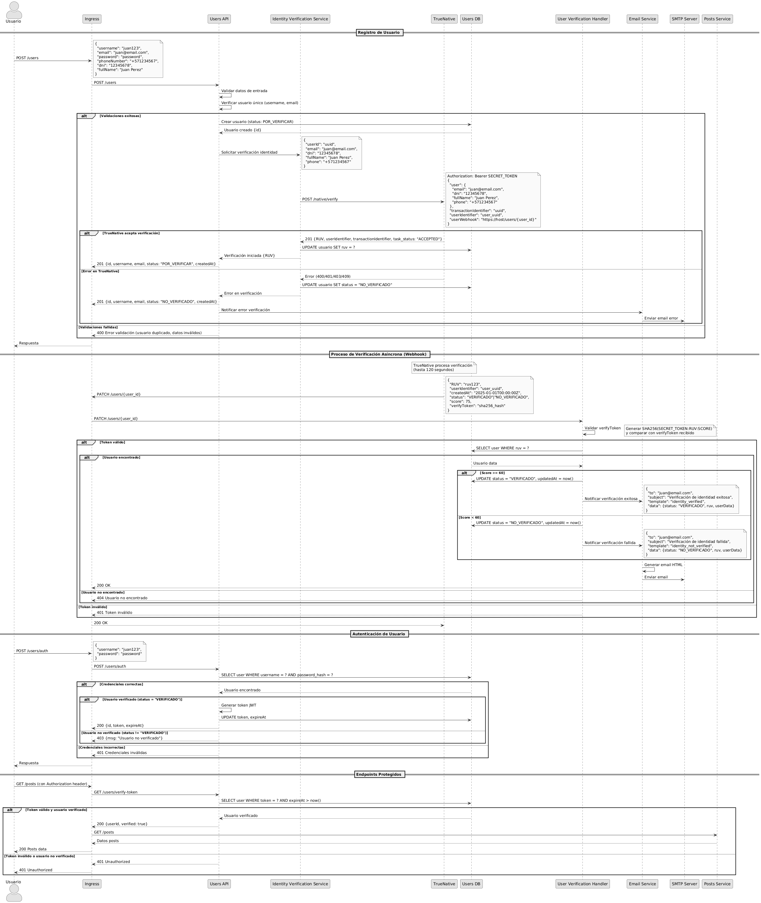

# Documentación Técnica - Sistema de Microservicios

## Equipo Cloudly

## 1. Propósito

Resumen ejecutivo del sistema de microservicios para gestión de usuarios, publicaciones, ofertas, rutas y cálculo de utilidades (score) con agregación de vistas compuestas vía Aggregator.

## 2. Equipo

**Integrantes (25% c/u):**

- jd.riosn1 – Users
- hvlopez – Posts
- l.carretero – Offers
- f.fernandezr – Routes

**Enlaces:**

- Dashboard: [Proyecto Kanban](https://github.com/orgs/MISW-4301-Desarrollo-Apps-en-la-Nube/projects/266)
- GitHub Pages: [Documentación Web](https://fluffy-funicular-z25pk9p.pages.github.io/)

### Vistas de Arquitectura

1. **[Vista de Información](information-view.md)** - Modelo de datos y entidades
2. **[Vista Funcional](functional-view.md)** - Componentes del sistema y nuevos componentes RF-006/RF-007
3. **[Vista de Despliegue](deployment-view.md)** - Arquitectura de despliegue y servicios en la nube
4. **[Vista de Desarrollo](development-view.md)** - Decisiones de desarrollo

### Documentación de Aplicaciones

- **[Users App](apps/Users.md)** - Microservicio de usuarios y verificación de identidad (RF-007)
- **[Posts App](apps/Posts.md)** - Microservicio de publicaciones
- **[Offers App](apps/Offers.md)** - Microservicio de ofertas
- **[Routes App](apps/Routes.md)** - Microservicio de rutas
- **[Scores App](apps/Scores.md)** - Microservicio de puntajes

### Requerimientos RF-006 y RF-007

#### Requerimiento RF-006: Almacenar Tarjetas de Crédito

- **[Documentación patrón solución requerimiento RF-006](rf006-patterns.md)** - Patrones arquitectónicos utilizados
- **[Explicación del proceso paso a paso de la solución requerimiento RF-006](rf006-process.md)** - Flujo detallado y manejo de errores

#### Requerimiento RF-007: Verificación de Identidad de Usuario

- **[Documentación patrón solución requerimiento RF-007](rf007-patterns.md)** - Patrones arquitectónicos utilizados
- **[Explicación del proceso paso a paso de la solución requerimiento RF-007](rf007-process.md)** - Flujo detallado y manejo de errores

## 3. Servicios

| Tipo         | Servicio     | Descripción                       | DB              | RF         |
| ------------ | ------------ | --------------------------------- | --------------- | ---------- |
| Dominio      | Users        | Gestión de usuarios y verificación identidad | users_db | RF001, RF007 |
| Dominio      | Posts        | Publicaciones de vuelos           | posts_db        | RF001      |
| Dominio      | Offers       | Ofertas de equipaje               | offers_db       | RF001      |
| Dominio      | Routes       | Rutas y segmentos                 | routes_db       | RF001      |
| Dominio      | Scores       | Cálculo y almacenamiento de score | scores_db       | RF004-RF005 |
| Dominio      | **Credit Cards** | **Gestión tarjetas de crédito** | **credit_cards_db** | **RF006** |
| Orquestación | Aggregator   | Flujos compuestos RF003–RF005     | N/A (stateless) | RF003-RF005 |
| Externo      | **TrueNative** | **Verificación identidad y tarjetas** | **N/A** | **RF006-RF007** |

## 4. Requerimientos Funcionales Clave

| ID    | Resumen                        | Notas                                      | Entrega |
| ----- | ------------------------------ | ------------------------------------------ | ------- |
| RF001 | CRUD básico entidades          | Servicios de dominio                       | 1       |
| RF002 | Reglas negocio básicas         | Validaciones locales                       | 1       |
| RF003 | Crear publicación compuesta    | Orquestado por Aggregator                  | 2       |
| RF004 | Crear oferta con score         | Score best-effort                          | 2       |
| RF005 | Consultar publicación agregada | Enriquecida con score y datos relacionales | 2       |
| **RF006** | **Almacenar tarjetas de crédito** | **Verificación asíncrona con TrueNative**  | **3**   |
| **RF007** | **Verificar identidad de usuario** | **Webhook pattern con TrueNative**       | **3**   |

## 5. Modelo de Datos (Resumen)

Entidades: User, Post, Offer, Route, Score. Relación 1:N (User→Post, Post→Offer, Post→Route). Score 1:1 con Offer (opcional). Detalle completo en `information-view.md`.

## 6. Patrones y Decisiones

| Categoría   | Decisión                | Motivación                            |
| ----------- | ----------------------- | ------------------------------------- |
| Integración | Aggregator Orchestrator | Centraliza validaciones y composición |
| Resiliencia | Best-effort score       | No bloquea flujos críticos            |
| Datos       | DB por servicio         | Aislamiento y autonomía               |
| Diseño      | Stateless Aggregator    | Escalado horizontal sencillo          |
| Validación  | Gateway lógico          | Reglas transversales centralizadas    |
| Identidad   | UUID tokens             | Simplicidad y restricción de alcance  |

## 7. Diagramas

| Tipo            | Archivo PNG                          | Descripción                    |
| --------------- | ------------------------------------ | ------------------------------ |
| Componentes     |  | Módulos y dependencias         |
| Entidades       |    | Modelo de dominio              |
| Despliegue      |  | Topología Kubernetes + Ingress |
| Secuencia RF003 |   | Creación publicación compuesta |
| Secuencia RF004 |   | Creación oferta + score        |
| Secuencia RF005 |   | Consulta publicación agregada  |
| **Secuencia RF006** | **** | **Almacenar tarjetas de crédito** |
| **Secuencia RF007** | **** | **Verificar identidad de usuario** |

## 8. Tecnologías

| Área             | Selección                            |
| ---------------- | ------------------------------------ |
| Lenguaje         | Python 3.9+                          |
| Framework        | Flask + Flask-Smorest                |
| ORM / Validación | SQLAlchemy / Marshmallow             |
| DB               | PostgreSQL (prod), SQLite (tests)    |
| Contenedores     | Docker                               |
| Orquestación     | Kubernetes (Minikube / EKS objetivo) |
| CI/CD            | GitHub Actions + Docker Hub          |
| Docs             | Markdown + PlantUML + Vale           |
| Testing          | pytest + pytest-cov                  |

## 9. Seguridad y Resiliencia

- Tokens UUID simples (alcance restringido)
- Validaciones: ownership, expiraciones, unicidad oferta por usuario/publicación
- Pings previos a dominios en flujos compuestos (defensive ping)
- Score degradable (null aceptado) y recomputable

## 10. Ejecución Local (Resumen)

1. Construir imágenes: `make build` (o `docker build` por servicio)
2. Levantar servicios básicos (ejemplo): `docker compose up -d` (si se agrega compose) o scripts individuales
3. Aplicar migraciones/init (cuando corresponda)
4. Probar endpoints base: `/ping`, `/users`, `/posts`
5. Flujos compuestos: `/rf003`, `/rf004`, `/rf005` vía Aggregator

(Ver README raíz para comandos detallados de Kubernetes si aplica)

## 11. Testing y Calidad

- Cobertura mínima 70% (`pytest --cov`)
- Validación de estilos de documentación con Vale
- Tests de integración para RF003–RF005 (Aggregator)

## 12. Próximos Pasos Sugeridos

| Área           | Mejora                                      |
| -------------- | ------------------------------------------- |
| Observabilidad | Métricas Prometheus + tracing OpenTelemetry |
| Resiliencia    | Circuit breaker real para Score             |
| Seguridad      | Expiración y rotación de tokens             |
| Automatización | Helm chart unificado                        |
| Datos          | Cache ligera para consultas RF005           |

## 13. Referencias

- `functional-view.md` – Flujos y reglas
- `information-view.md` – Modelo de datos detallado
- `deployment-view.md` – Infraestructura y topología
- `development-view.md` – Decisiones y patrones
