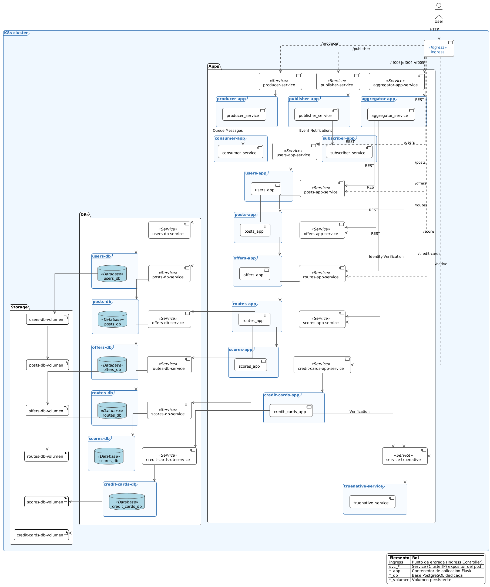

# Vista de Despliegue

## Descripción General

La solución se despliega sobre Kubernetes (EKS en producción / Minikube en desarrollo). A los cuatro microservicios iniciales se suman Aggregator (orquestación) y Scores (utilidad). Un único Ingress concentra el acceso externo y distribuye tráfico por prefijo.

## Arquitectura de Despliegue

### Plataforma de Orquestación

- **Kubernetes**: Plataforma principal de orquestación de contenedores
- **Minikube**: Clúster local de Kubernetes para desarrollo y testing
- **Namespace**: Todas las aplicaciones se despliegan en el namespace `default`

### Estrategia de Contenedores

Cada servicio de aplicación se ejecuta como contenedor stateless; cada dominio mantiene su propia instancia de base de datos PostgreSQL (aislamiento por servicio). Para desarrollo se permiten despliegues efímeros.

### Servicios de Red

- **ClusterIP**: Exposición interna de cada servicio.
- **Ingress**: Distribuye solicitudes externas a Aggregator y a servicios base (`/users`, `/posts`, `/offers`, `/routes`, `/score`, `/rf004`, `/rf005`).
- **Aislamiento lógico**: Basado en separación de responsabilidades; NetworkPolicies futuras podrían restringir acceso directo cliente → dominios.

## Modelo de Despliegue

### Estructura de Pods (Resumen)

| Pod           | Rol                         | Persistencia        | Nuevos en RF006/007 |
| ------------- | --------------------------- | ------------------- | ------------------- |
| Users         | Autenticación y usuarios    | PostgreSQL dedicada | ✓ Verificación      |
| Posts         | Publicaciones               | PostgreSQL dedicada |                     |
| Offers        | Ofertas                     | PostgreSQL dedicada |                     |
| Routes        | Trayectos y costos          | PostgreSQL dedicada |                     |
| Scores        | Utilidad de ofertas         | PostgreSQL dedicada |                     |
| Aggregator    | Orquestación RF003–RF005    | Sin BD propia       |                     |
| Credit Cards  | Gestión tarjetas crédito    | PostgreSQL dedicada | ✓ Nuevo RF-006      |
| TrueNative    | Verificación externa        | Sin BD propia       | ✓ Nuevo Servicio    |

### Configuración de Servicios

El Ingress enruta prefijos a servicios lógicos; sólo se exponen servicios como `ClusterIP`. NodePorts previos no son necesarios en el modelo consolidado.

## Diagrama de Despliegue



El diagrama actualizado incluye Aggregator (frontal lógico) y Scores.

## Modelo de Red

### Aislamiento de Red

El aislamiento se soporta por separación de bases de datos y uso de Aggregator para flujos compuestos. NetworkPolicies adicionales pueden restringir comunicaciones en evoluciones futuras.

### Políticas de Red

- **Ingress**: Redirige prefijos a servicios lógicos.
- **Egress**: Servicios de aplicación sólo requieren salida hacia sus propias bases de datos.
- **Namespace**: Todo reside en `default` según restricción del curso.

## Diagrama de Red


## Configuración de Recursos

### Volúmenes

- Desarrollo: volúmenes efímeros (emptyDir).
- Producción: servicios gestionados (RDS) sin alterar el contrato de aplicación.

### Variables de Entorno

#### Aplicaciones Base

Cada aplicación requiere las siguientes variables:

- `DATABASE_URI`: Conexión a la base de datos PostgreSQL
- `FLASK_ENV`: Entorno de ejecución (development/production)
- `POSTGRES_DB`: Nombre de la base de datos
- `POSTGRES_USER`: Usuario de la base de datos
- `POSTGRES_PASSWORD`: Contraseña de la base de datos

#### TrueNative Service (RF-006/RF-007)

- `SECRET_TOKEN`: Token compartido para autenticación con TrueNative
- `MAX_WEBHOOK_DELAY`: Tiempo máximo de respuesta webhook (default: 120 seg)
- `MAX_POLL_DELAY`: Tiempo máximo de respuesta polling (default: 30 seg)
- `SUCCESS_RATE`: Tasa de éxito simulada (default: 50, testing: 100)
- `PUBLIC_BASE_URL`: URL base para webhooks de usuarios

#### Credit Cards App (RF-006)

- Todas las variables base de aplicación
- `TRUENATIVE_URL`: URL del servicio TrueNative
- `TRUENATIVE_TOKEN`: Token para autenticación con TrueNative
- `POLLING_INTERVAL`: Intervalo de polling en segundos (default: 30)
- `SMTP_HOST`: Servidor SMTP para notificaciones
- `SMTP_USER`: Usuario SMTP
- `SMTP_PASS`: Contraseña SMTP

#### Users App (RF-007)

- Todas las variables base de aplicación
- `TRUENATIVE_URL`: URL del servicio TrueNative
- `TRUENATIVE_TOKEN`: Token para autenticación con TrueNative
- `WEBHOOK_BASE_URL`: URL base para recibir webhooks
- Variables SMTP (heredadas del servicio base)

### Puertos y Conectores

- Aplicaciones: 5000 interno
- Bases de datos: 5432 interno
- Acceso externo: Ingress → Aggregator / dominios
- Protocolos: HTTP/REST, PostgreSQL

## Estrategias de Despliegue

### Despliegue Local

1. **Minikube**: Inicialización del clúster local
2. **Docker Images**: Construcción de imágenes locales
3. **Kubernetes Manifests**: Aplicación de configuraciones YAML
4. **Port Forwarding**: Acceso a servicios para testing

### Escalabilidad

- Aggregator: Escalado horizontal según demanda (lecturas compuestas RF005).
- Scores: Escala por volumen de escritura (RF004) y lectura (RF005).
- Dominios: Escalan autónomamente.
- Balanceo: Service + Ingress.

### Monitoreo y Logging

- Health Checks: `/rf005/ping` (Aggregator), `/ping` (dominios), `/native/ping` (TrueNative), `/credit-cards/ping` (Credit Cards).
- Logs: Orquestación y errores transversales, polling de tarjetas, webhooks de usuarios.
- Métricas sugeridas: Latencia RF003/4/5, errores 5xx por servicio, tasa de éxito verificaciones TrueNative.

## Despliegues RF-006 y RF-007

### Componentes de Despliegue Nuevos

#### TrueNative Service

```yaml
apiVersion: apps/v1
kind: Deployment
metadata:
  name: truenative
spec:
  replicas: 1
  template:
    spec:
      containers:
        - name: truenative
          image: ghcr.io/misw-4301-desarrollo-apps-en-la-nube/true-native:2.0.0
          ports:
            - containerPort: 3000
          env:
            - name: SECRET_TOKEN
              value: "supersecreto123"
            - name: PUBLIC_BASE_URL
              value: "http://users-app-service"
```

#### Credit Cards App

```yaml
apiVersion: apps/v1
kind: Deployment
metadata:
  name: credit-cards-app
spec:
  replicas: 2
  template:
    spec:
      containers:
        - name: credit-cards-app
          image: credit-cards-app:latest
          ports:
            - containerPort: 5000
          env:
            - name: DATABASE_URI
              value: "postgresql://..."
            - name: TRUENATIVE_URL
              value: "http://service-truenative"
```

### Consideraciones de Red para RF-006/RF-007

#### Ingress Routes

```yaml
apiVersion: networking.k8s.io/v1
kind: Ingress
metadata:
  name: complete-ingress
spec:
  rules:
  - http:
      paths:
      - path: /credit-cards
        pathType: Prefix
        backend:
          service:
            name: credit-cards-service
            port:
              number: 80
      - path: /native
        pathType: Prefix
        backend:
          service:
            name: service-truenative
            port:
              number: 80
      - path: /users/webhook
        pathType: Prefix
        backend:
          service:
            name: users-app-service
            port:
              number: 80
```

#### Políticas de Red RF-006/RF-007

- **Credit Cards → TrueNative**: Acceso HTTP para registro y polling
- **Credit Cards → Users**: Validación de tokens de usuarios
- **Users → TrueNative**: Solicitud de verificación de identidad
- **TrueNative → Users**: Webhooks de verificación (entrada)
- **Email Service**: Salida SMTP para notificaciones

### Volúmenes y Persistencia

#### Credit Cards Database

```yaml
apiVersion: apps/v1
kind: Deployment
metadata:
  name: credit-cards-db
spec:
  template:
    spec:
      containers:
        - name: postgres
          image: postgres:15
          env:
            - name: POSTGRES_DB
              value: "credit_cards_db"
          volumeMounts:
            - name: postgres-storage
              mountPath: /var/lib/postgresql/data
```

### Estrategias de Alta Disponibilidad

#### Circuit Breaker Pattern

- **Credit Cards ↔ TrueNative**: Timeout 30s, fallback a estado ERROR
- **Users ↔ TrueNative**: Timeout 10s, fallback a estado POR_VERIFICAR

#### Retry Strategies

- **Polling Credit Cards**: Exponential backoff, max 5 reintentos
- **Webhook Users**: Immediate response, async processing
- **Email Notifications**: Queue-based retry con DLQ

### Escalabilidad RF-006/RF-007

#### Horizontal Pod Autoscaler

```yaml
apiVersion: autoscaling/v2
kind: HorizontalPodAutoscaler
metadata:
  name: credit-cards-hpa
spec:
  scaleTargetRef:
    apiVersion: apps/v1
    kind: Deployment
    name: credit-cards-app
  minReplicas: 2
  maxReplicas: 10
  metrics:
  - type: Resource
    resource:
      name: cpu
      target:
        type: Utilization
        averageUtilization: 70
```

## Seguridad

### Network Policies

- Aislamiento completo entre microservicios
- Restricción de acceso a bases de datos
- Control de tráfico entrante y saliente

### Autenticación

- Tokens UUID (no JWT).
- Validación y propagación desde Aggregator.

### Base de Datos

- Conexiones aisladas y sin acceso cruzado.
- Scores mantiene independencia y sólo depende de IDs de ofertas.
