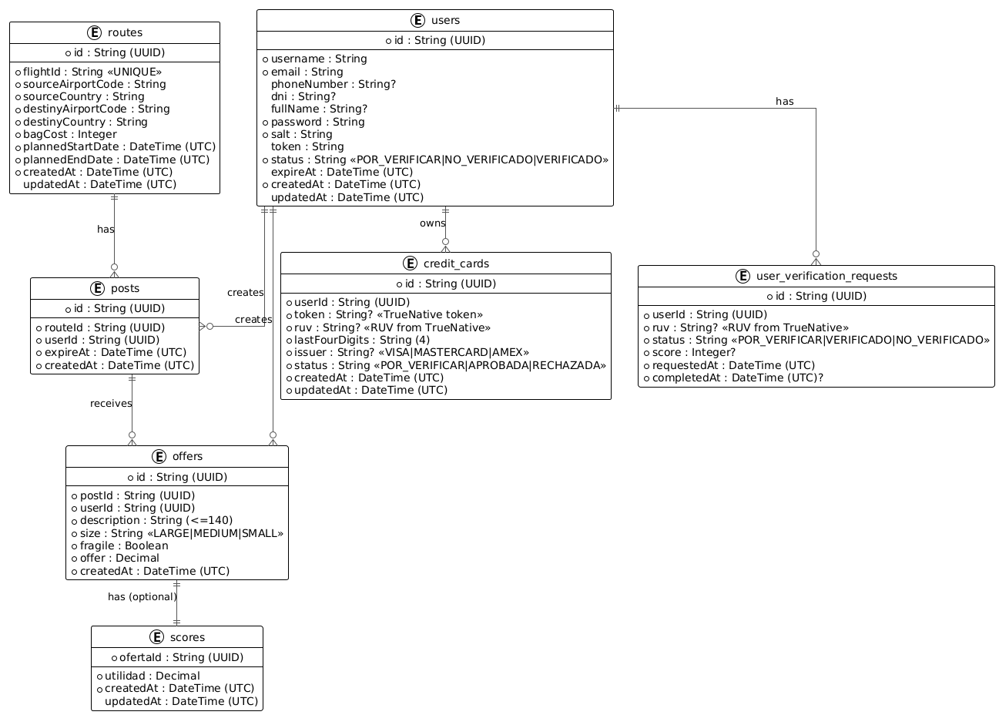

# Vista de Información

## Introducción

Modelo de datos del sistema: entidades, atributos, relaciones y reglas. A los dominios originales (User, Post, Offer, Route) se suma `Score` para RF004–RF005, con registro best‑effort.

## Entidades

Resumen estructurado de cada dominio.

### User

| Campo       | Tipo     | Descripción                                  |
| ----------- | -------- | -------------------------------------------- |
| id          | UUID     | Identificador                                |
| username    | string   | Único                                        |
| email       | string   | Correo                                       |
| phoneNumber | string?  | Contacto opcional                            |
| dni         | string?  | Documento                                    |
| fullName    | string?  | Nombre completo                              |
| password    | string   | Hash (almacenado)                            |
| salt        | string   | Sal usada en hash                            |
| token       | UUID     | Token temporal                               |
| status      | enum     | POR_VERIFICAR \| NO_VERIFICADO \| VERIFICADO |
| expireAt    | datetime | Expiración sesión                            |
| createdAt   | datetime | Auditoría                                    |
| updatedAt   | datetime | Auditoría                                    |

### Post

| Campo              | Tipo     | Descripción            |
| ------------------ | -------- | ---------------------- |
| id                 | UUID     | Identificador          |
| routeId            | UUID     | Ruta asociada (lógica) |
| userId             | UUID     | Propietario            |
| expireAt           | datetime | Límite de ofertas      |
| createdAt          | datetime | Auditoría              |
| plannedStartDate\* | datetime | Derivado de Route      |
| plannedEndDate\*   | datetime | Derivado de Route      |

\*Campos proyectados: no se duplican físicamente; se obtienen al componer respuesta.

### Offer

| Campo       | Tipo     | Descripción              |
| ----------- | -------- | ------------------------ |
| id          | UUID     | Identificador            |
| postId      | UUID     | Publicación              |
| userId      | UUID     | Ofertante                |
| description | string   | Máx. 140 chars           |
| size        | enum     | LARGE \| MEDIUM \| SMALL |
| fragile     | bool     | Bandera de fragilidad    |
| offer       | float    | Monto ofertado           |
| createdAt   | datetime | Auditoría                |

### Route

| Campo              | Tipo     | Descripción          |
| ------------------ | -------- | -------------------- |
| id                 | UUID     | Identificador        |
| flightId           | string   | Único (idempotencia) |
| sourceAirportCode  | string   | Origen               |
| sourceCountry      | string   | País origen          |
| destinyAirportCode | string   | Destino              |
| destinyCountry     | string   | País destino         |
| bagCost            | int      | Costo base maleta    |
| plannedStartDate   | datetime | Inicio planificado   |
| plannedEndDate     | datetime | Fin planificado      |
| createdAt          | datetime | Auditoría            |
| updatedAt          | datetime | Auditoría            |

### Score

| Campo     | Tipo      | Descripción             |
| --------- | --------- | ----------------------- |
| id        | UUID      | Identificador (técnico) |
| ofertaId  | UUID      | Oferta (clave lógica)   |
| utilidad  | float     | Valor calculado         |
| createdAt | datetime  | Auditoría               |
| updatedAt | datetime? | Recalculo               |

Fórmula:

```text
occupancy = { LARGE:1.0, MEDIUM:0.5, SMALL:0.25 }[size]
utilidad = offer - (occupancy * bagCost)
```

Best‑effort: falla de persistencia no bloquea creación de Offer (se expondrá `null`).

### CreditCard (RF-006)

| Campo          | Tipo     | Descripción                                          |
| -------------- | -------- | ---------------------------------------------------- |
| id             | UUID     | Identificador                                        |
| token          | string   | Token seguro generado por TrueNative (256 chars)    |
| userId         | UUID     | Propietario de la tarjeta                           |
| lastFourDigits | string   | Últimos 4 dígitos de la tarjeta                     |
| ruv            | string   | Registro Único de Verificación de TrueNative        |
| issuer         | enum     | VISA \| MASTERCARD \| AMERICAN EXPRESS \| DISCOVER \| DINERS CLUB \| UNKNOWN |
| status         | enum     | POR_VERIFICAR \| RECHAZADA \| APROBADA               |
| createdAt      | datetime | Auditoría                                            |
| updatedAt      | datetime | Auditoría                                            |
| fingerprint    | string   | Hash único para prevenir duplicados (128 chars)     |

Estados:

- **POR_VERIFICAR**: Tarjeta registrada, esperando respuesta de TrueNative
- **APROBADA**: Tarjeta verificada exitosamente por TrueNative  
- **RECHAZADA**: Tarjeta rechazada por TrueNative

Verificación asíncrona via polling cada 30 segundos a TrueNative `/native/cards/{ruv}`.

## Relaciones

- User 1..N Post
- User 1..N Offer
- User 1..N CreditCard (RF-006)
- Route 1..N Post
- Post 1..N Offer
- Offer 1..1 Score (opcional)

## Diagrama



## Reglas

Validación:

1. UUIDs válidos
2. Fechas ISO8601 UTC
3. Tokens = UUID (Users) | string seguro (CreditCard)
4. Expiración futura en Post para aceptar Offers
5. Tamaños permitidos LARGE|MEDIUM|SMALL
6. Precios > 0
7. Solo usuarios VERIFICADO pueden crear tokens (RF-007)
8. Solo usuarios VERIFICADO pueden registrar tarjetas (RF-006)
9. Tarjetas no vencidas al momento de registro
10. Una tarjeta por usuario (validación por fingerprint)

Aislamiento:

- Base de datos por servicio, sin FK inter‑DB
- Referencias lógicas resueltas en Aggregator

Persistencia:

- PostgreSQL independiente por dominio
- `/reset` sólo pruebas
- Score eventual (puede retrasarse)
- Auditoría mínima (`createdAt`, `updatedAt` cuando aplica)

Consistencia:

- Idempotencia de Route por `flightId`
- Ausencia de Score → `null` (no error)
- Lógica transversal centralizada en Aggregator
