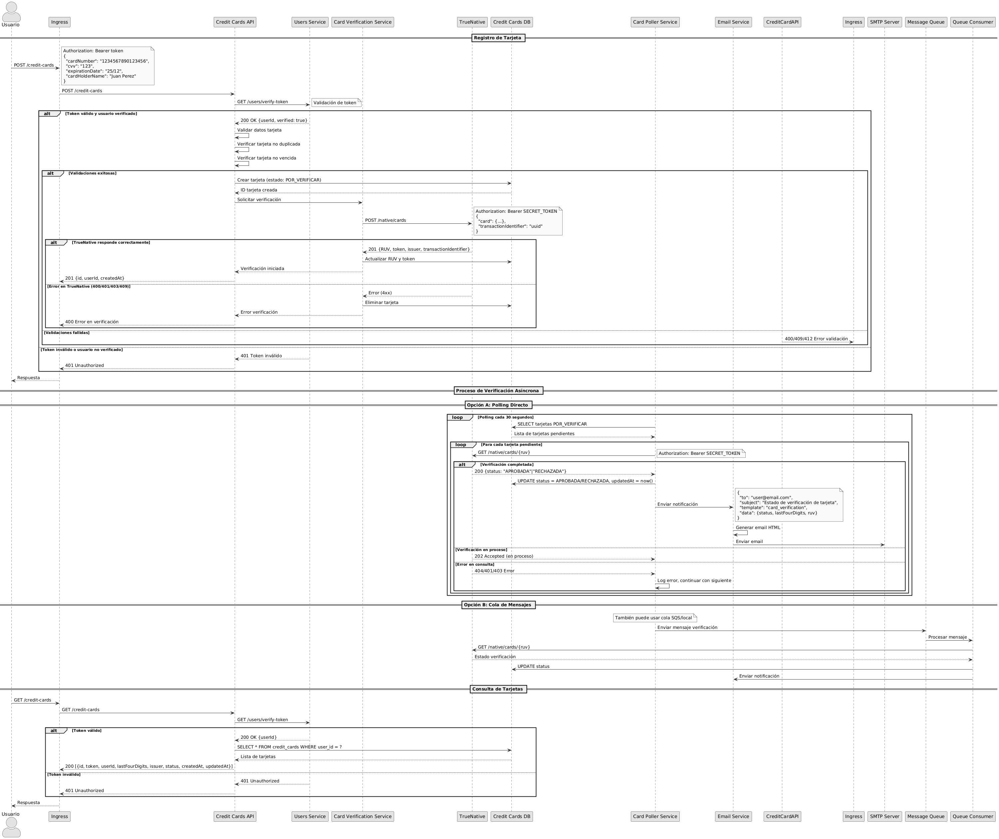

# Proceso RF-006: Registro y Verificación de Tarjetas de Crédito

## Descripción General

Este documento describe el proceso paso a paso para el requerimiento RF-006, que permite a los usuarios almacenar sus tarjetas de crédito en la plataforma con verificación asíncrona mediante TrueNative.

## Flujo Principal

### 1. Registro de Tarjeta

El proceso inicia cuando un usuario autenticado solicita registrar una tarjeta de crédito:

1. **Validación de Autenticación**: El sistema valida el token JWT del usuario
2. **Verificación de Usuario**: Confirma que el usuario está en estado VERIFICADO
3. **Validación de Datos**: Verifica formato y validez de los datos de la tarjeta
4. **Verificación de Duplicados**: Confirma que la tarjeta no esté ya registrada
5. **Verificación de Vigencia**: Valida que la tarjeta no esté vencida
6. **Creación en BD**: Almacena la tarjeta con estado POR_VERIFICAR
7. **Solicitud a TrueNative**: Envía datos a TrueNative para verificación

### 2. Procesamiento Asíncrono

Después del registro inicial, el sistema ejecuta un proceso asíncrono:

1. **Polling Periódico**: Cada 30 segundos consulta el estado en TrueNative
2. **Actualización de Estado**: Cuando TrueNative responde, actualiza el estado
3. **Notificación por Email**: Envía email al usuario con el resultado

## Manejo de Errores

### Errores de Validación

- **401 Unauthorized**: Token inválido o usuario no verificado
- **400 Bad Request**: Datos de tarjeta inválidos o malformados
- **409 Conflict**: Tarjeta ya registrada por el usuario
- **412 Precondition Failed**: Tarjeta vencida

### Errores de TrueNative

- **400/401/403**: Errores de autenticación o datos en TrueNative
- **409**: Conflicto en TrueNative (tarjeta ya en proceso)
- **Timeout**: Si TrueNative no responde, se elimina la tarjeta creada

### Errores de Polling

- **404**: RUV no encontrado (se registra error y continúa)
- **401/403**: Problemas de autenticación (se reintenta)
- **Network Errors**: Se reintenta en el siguiente ciclo

## Diagrama de Secuencia

## Estados de Tarjeta

| Estado | Descripción | Acciones Permitidas |
|--------|-------------|-------------------|
| **POR_VERIFICAR** | Tarjeta creada, esperando respuesta de TrueNative | Consultar, Eliminar |
| **APROBADA** | Tarjeta verificada exitosamente | Consultar, Usar para pagos |
| **RECHAZADA** | Tarjeta rechazada por TrueNative | Consultar, Eliminar |

## Consideraciones Técnicas

### Polling vs Webhook

Se utiliza una combinación de polling y colas de mensajes:

- **Polling Directo**: Consultas periódicas cada 30 segundos a TrueNative
- **Cola de Mensajes**: Sistema de colas (SQS/local) para procesamiento asíncrono
- **Consumer Service**: Procesa mensajes de la cola y actualiza estados

Esta arquitectura híbrida balancea:

- **Responsividad**: Actualizaciones relativamente rápidas
- **Escalabilidad**: Procesamiento distribuido via colas
- **Resiliencia**: Retry automático y DLQ para fallos

### Seguridad

- **Validación de Token**: Cada operación requiere token válido
- **Usuario Verificado**: Solo usuarios verificados pueden registrar tarjetas
- **Datos Sensibles**: Solo se almacenan últimos 4 dígitos y token seguro
- **HTTPS**: Toda comunicación cifrada

### Escalabilidad

- **Polling Distribuido**: El poller puede ejecutarse en múltiples instancias
- **Base de Datos**: Índices en user_id y ruv para consultas eficientes
- **Circuit Breaker**: Protección contra fallos de TrueNative