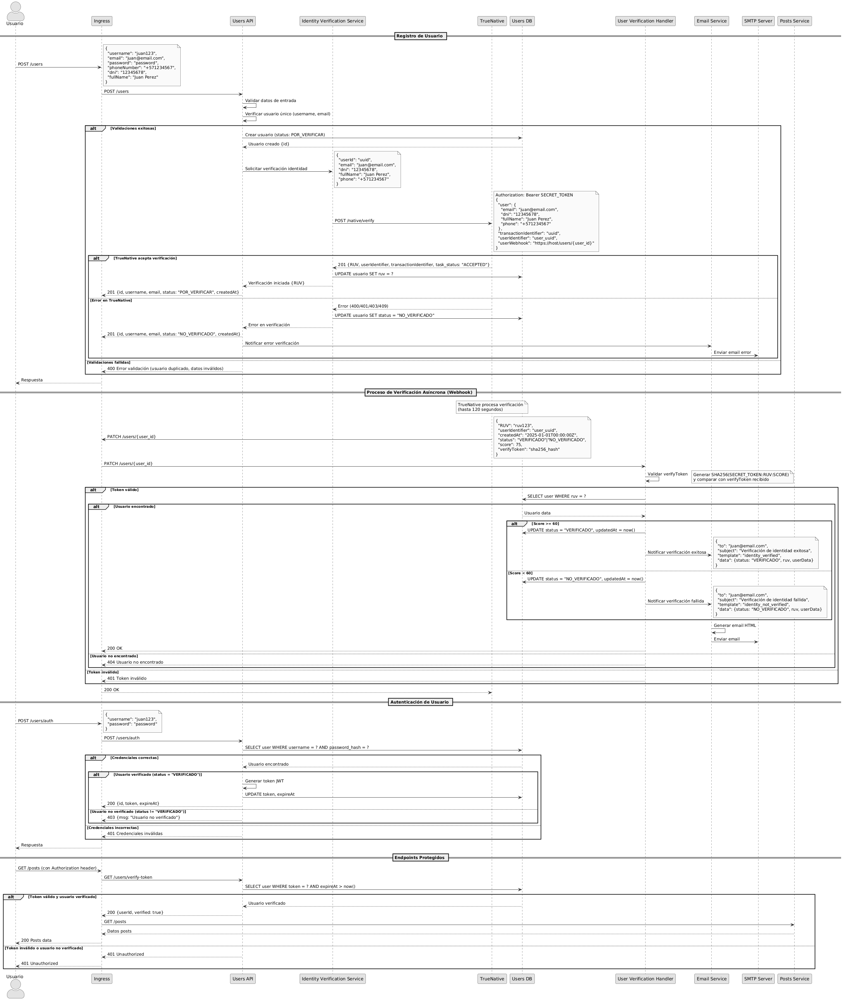

# Proceso RF-007: Verificación de Identidad de Usuario

## Descripción General

Este documento describe el proceso paso a paso para el requerimiento RF-007, que verifica automáticamente la identidad de los usuarios al momento de registro mediante TrueNative y restringe el acceso hasta completar la verificación.

## Flujo Principal

### 1. Registro de Usuario

El proceso inicia cuando un nuevo usuario se registra en la plataforma:

1. **Validación de Datos**: Verifica formato y completitud de los datos de registro
2. **Verificación de Unicidad**: Confirma que username y email no estén en uso
3. **Creación en BD**: Almacena usuario con estado POR_VERIFICAR
4. **Solicitud de Verificación**: Envía datos a TrueNative para verificación de identidad
5. **Configuración de Webhook**: Configura endpoint para recibir respuesta asíncrona

### 2. Procesamiento de Webhook

Cuando TrueNative completa la verificación (hasta 120 segundos):

1. **Recepción de Webhook**: TrueNative envía resultado al endpoint configurado
2. **Validación de Token**: Verifica autenticidad del mensaje usando SHA256
3. **Evaluación de Score**: Analiza puntaje de verificación (≥60 = VERIFICADO)
4. **Actualización de Estado**: Cambia estado del usuario según resultado
5. **Notificación por Email**: Informa al usuario el resultado del proceso

### 3. Control de Acceso

Una vez procesado el webhook, el sistema implementa controles:

1. **Validación en Autenticación**: Solo usuarios VERIFICADO pueden generar tokens
2. **Interceptor en APIs**: Todos los endpoints protegidos validan estado de usuario
3. **Restricción de Funcionalidades**: Bloquea acceso a servicios para usuarios no verificados

## Manejo de Errores

### Errores de Registro

- **400 Bad Request**: Datos de usuario inválidos o incompletos
- **409 Conflict**: Username o email ya registrados
- **500 Internal Error**: Fallos en comunicación con TrueNative

### Errores de Webhook

- **401 Unauthorized**: Token de verificación inválido
- **404 Not Found**: Usuario no encontrado por RUV
- **400 Bad Request**: Formato de webhook incorrecto

### Degradación Controlada

Si TrueNative no está disponible durante el registro:
- Usuario se crea en estado POR_VERIFICAR
- Email de notificación informa sobre pendiente de verificación
- Reintentos automáticos en segundo plano

## Diagrama de Secuencia



## Estados de Usuario

| Estado | Descripción | Acciones Permitidas |
|--------|-------------|-------------------|
| **POR_VERIFICAR** | Usuario creado, esperando verificación | Login bloqueado, Solo consulta de estado |
| **VERIFICADO** | Identidad verificada exitosamente | Acceso completo a todos los servicios |
| **NO_VERIFICADO** | Verificación fallida | Login bloqueado, Solo consulta de estado |

## Integración con Servicios Existentes

### Modificaciones en Users Service

- **Modelo de Usuario**: Agregado campo `status` con enum de estados
- **Autenticación**: Validación de estado VERIFICADO para generar tokens
- **Webhook Endpoint**: Nuevo endpoint para procesar callbacks de TrueNative

### Interceptores en APIs

Todos los microservicios (Posts, Offers, Routes, Credit Cards) implementan:
- Validación de token con Users Service
- Verificación de estado VERIFICADO del usuario
- Respuesta 401/403 para usuarios no verificados

## Consideraciones de Seguridad

### Validación de Webhooks

```text
Token = SECRET_TOKEN + ":" + RUV + ":" + SCORE
SHA256_Expected = SHA256(Token)
Validation = SHA256_Expected == ReceivedToken
```

### Datos de Verificación

- **Información Personal**: DNI, nombre completo, teléfono, email
- **Privacidad**: Datos no almacenados permanentemente, solo para verificación
- **Cifrado**: Comunicación HTTPS con TrueNative

### Control de Acceso

- **Principio de Menor Privilegio**: Acceso bloqueado por defecto
- **Verificación Continua**: Validación en cada request a APIs protegidas
- **Tokens Seguros**: JWT con expiración y validación de estado

## Configuración Técnica

### Variables de Entorno

- **SECRET_TOKEN**: Token compartido con TrueNative para validación
- **USERS_PUBLIC_BASE_URL**: URL base para construir webhooks (ejemplo: `http://users-app-service`)
- **TRUENATIVE_BASE_URL**: URL del servicio TrueNative
- **GMAIL_USER**: Usuario Gmail para envío de emails
- **GMAIL_PASS**: Contraseña de aplicación Gmail

### Endpoints

- **Webhook**: `PATCH /users/{user_id}`
- **Verificación de Token**: `GET /users/me`
- **Estado de Usuario**: `GET /users/me`